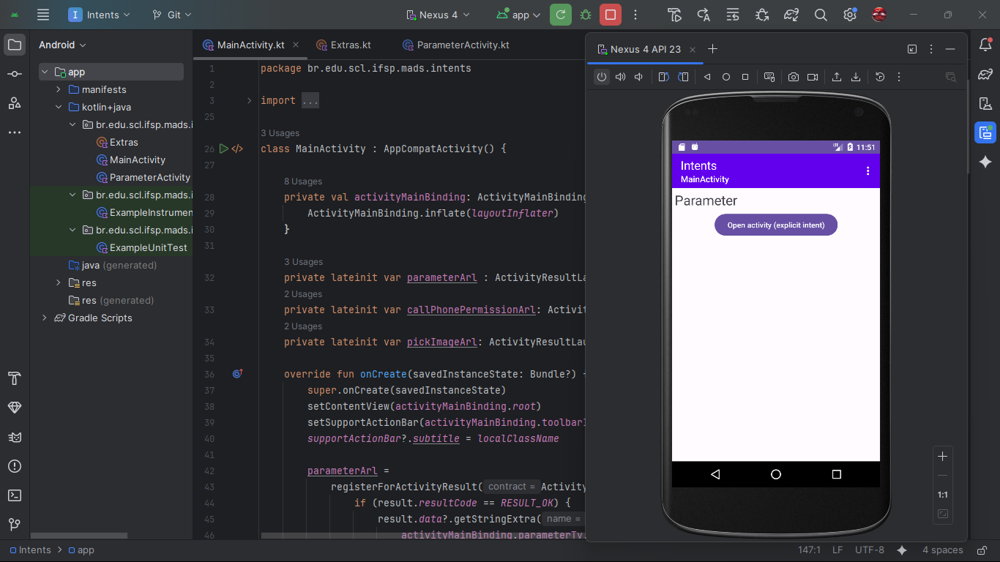

# 📱 Intents App

Um aplicativo Android desenvolvido em **Kotlin** com o objetivo de **demonstrar e praticar o uso de Intents**, tanto explícitas quanto implícitas, para navegação entre Activities e interação com outros aplicativos do sistema.  
Este projeto foi criado para fins acadêmicos no contexto da disciplina de **Desenvolvimento de Aplicações Móveis**.

---

## 🚀 Funcionalidades

- **Intents Explícitas**
  - Navegar para uma segunda Activity (`ParameterActivity`) enviando dados e recebendo um resultado de volta.
  - Uso de `ActivityResultLauncher` para o modelo moderno de obter resultados entre Activities.

- **Intents Implícitas**
  - **Abrir Navegador:** insira uma URL e abra no navegador padrão.
  - **Chamada Telefônica:** insira um número e inicie uma chamada direta (*requer permissão `CALL_PHONE`*).
  - **Abrir Discador:** insira um número e abra o discador do sistema já preenchido.
  - **Selecionar Imagem:** escolha uma imagem da galeria e exiba no app.
  - **Chooser (Seletor de Apps):** demonstra como apresentar uma lista de aplicativos capazes de lidar com uma ação (exemplo: abrir navegador).

- **Gerenciamento de Permissões**
  - Solicitação da permissão `CALL_PHONE` em tempo de execução usando `ActivityResultLauncher`.

- **Menu de Opções**
  - Todas as funcionalidades estão acessíveis por meio de um menu na barra de aplicativos.

---

## 🛠 Tecnologias Utilizadas

- [Kotlin](https://kotlinlang.org/) — linguagem principal  
- [Android Studio](https://developer.android.com/studio) — IDE  
- **ViewBinding** — para acesso seguro aos elementos da interface  
- **ActivityResultLauncher** — para navegação e permissões no modelo moderno  
- **Material Components** — para UI mais moderna e responsiva  

---

## 📂 Estrutura do Projeto

```
Intents/
│
├── app/
│ ├── src/
│ │ ├── main/
│ │ │ ├── java/br/edu/scl/ifsp/mads/intents/
│ │ │ │ ├── MainActivity.kt # Activity principal
│ │ │ │ ├── ParameterActivity.kt # Activity secundária (navegação explícita)
│ │ │ │ └── Extras.kt # Constantes para chaves de extras
│ │ │ ├── res/
│ │ │ │ ├── layout/
│ │ │ │ │ ├── activity_main.xml
│ │ │ │ │ └── activity_parameter.xml
│ │ │ │ ├── menu/
│ │ │ │ │ └── menu_main.xml
│ │ │ │ └── values/ (strings, estilos, cores etc.)
│ │ │ └── AndroidManifest.xml
│ ├── build.gradle (nível do módulo)
│
├── build.gradle (nível do projeto)
├── settings.gradle
└── gradle/

   ```
## 📸 Demonstração do App

### 00 - Parameter Activity
Demonstra a segunda Activity recebendo parâmetros via Intent explícita.  


### 01 - Intent Explícita
Tela inicial com exemplo de navegação usando Intent explícita.  


### 02 - Intent Explícita (Abrir Activity)
Mostra a abertura de uma nova Activity passando dados.  
.png)

### 03 - Intent Implícita (Menu)
Exibe as opções de ações disponíveis no menu para testar Intents implícitas.  
.png)

### 04 - Intent Implícita (Abrir Navegador)
O usuário insere uma URL e o app abre o navegador padrão.  
.png)

### 05 - Intent Implícita (Chamada Telefônica)
Permite inserir um número e iniciar uma chamada direta (com permissão).  
.png)

### 06 - Intent Implícita (Discador)
Abre o discador do sistema com o número já preenchido.  
.png)

### 07 - Intent Implícita (Chooser / Multi-apps)
Mostra o `Chooser`, permitindo selecionar qual app abrirá a ação.  
.png)

### 08 - Emulando via Celular
Demonstra o uso do app em um dispositivo emulado.  


### 09 - Navegação Entre Telas
Fluxo entre diferentes Activities (1 → 2).  


### 10 - Navegação Entre Múltiplas Telas
Exemplo de interação com as telas 3, 4 e 9 no fluxo de uso.  


### 11 - Navegação Avançada
Exibe as telas 5, 6 e 7 do fluxo de navegação.  


---
## ⚠️ Observações Importantes

A funcionalidade de chamada direta requer a permissão:

<uses-permission android:name="android.permission.CALL_PHONE"/>


O campo de texto principal (parameterTv) é usado como entrada para as ações (ex.: URL para navegador, número para chamadas/discador).

## ▶️ Como Executar o Projeto

1. Clone este repositório:
   
   ```bash
   git clone https://github.com/MADS1974/Intents
   ```
2. Abra no **Android Studio**.  

3. Execute no emulador ou dispositivo físico.  

---

## 🎥 Vídeo Demonstrativo

Também há um vídeo mostrando o funcionamento do app:  
👉 [xIntents.mp4](./xIntents.mp4)

---

## 📚 Créditos

Projeto acadêmico desenvolvido para a disciplina **Desenvolvimento para Android 1 – D1DA1**, ministrada pelo professor **Pedro Northon Nobile (IFSP)**. 

---

## 🙋‍♂️ 

🔗 Conecte-se comigo

[LinkedIn - Márcio Adriano](https://www.linkedin.com/in/mads1974/)

